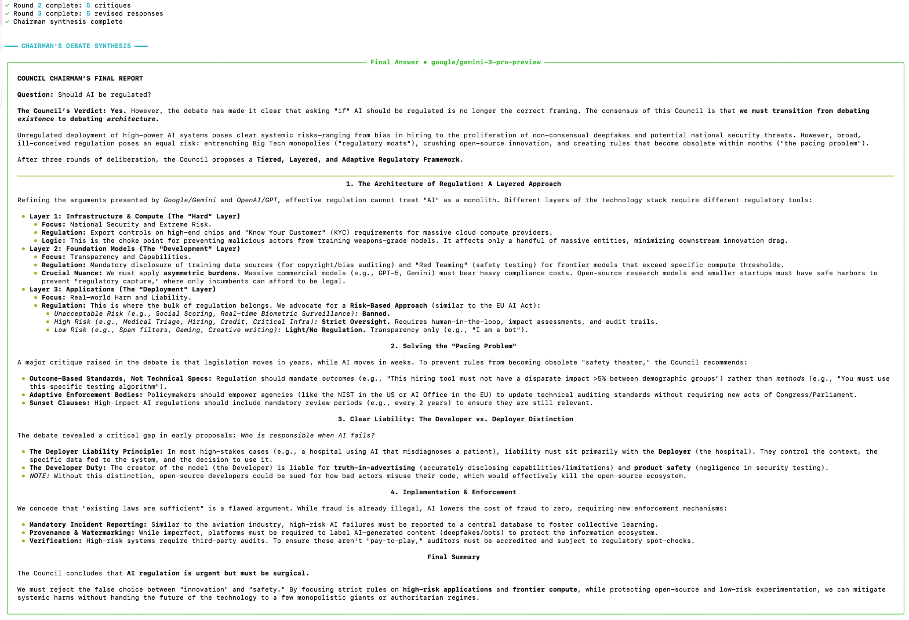
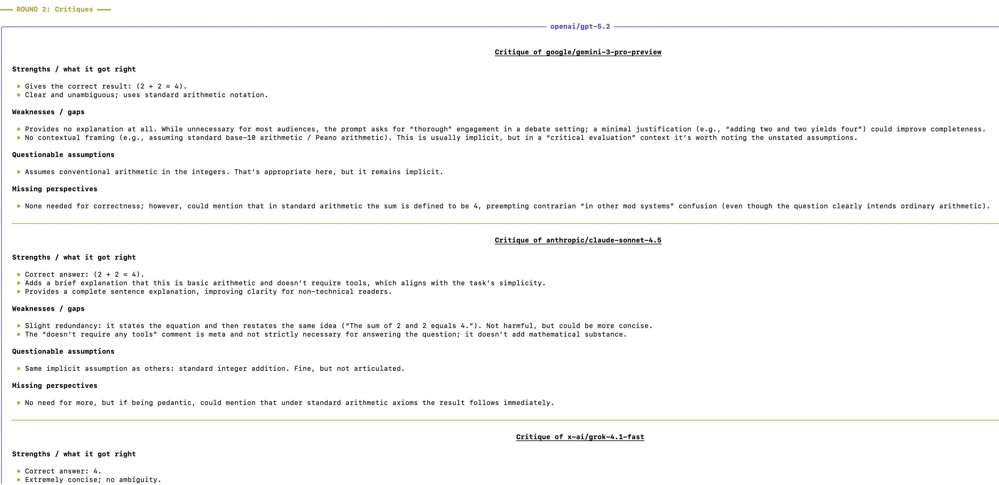
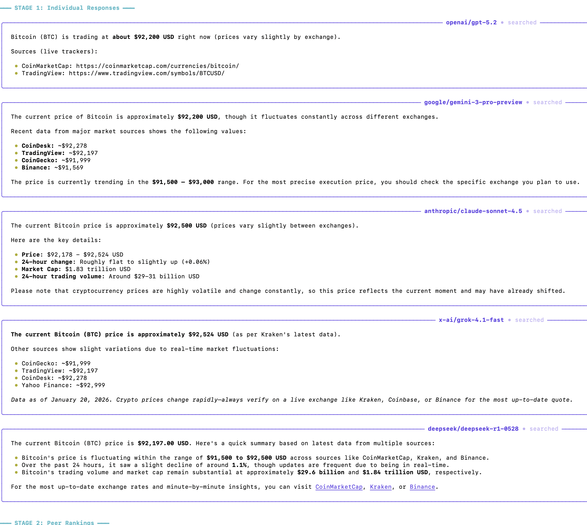

# LLM Council

[](LICENSE)
[](https://www.python.org/downloads/)
[](https://github.com/zhihaolin/llm-council-cli/actions/workflows/test.yml)
[](https://github.com/astral-sh/ruff)

**Multi-model deliberation for better answers.**

A system where AI models debate, critique, and synthesize answers together.

Instead of asking one LLM and hoping for the best, LLM Council orchestrates multiple frontier models through structured deliberation—producing more accurate, nuanced, and well-reasoned answers.



## Why This Exists

Single-model responses have blind spots. LLM Council fixes this by:

1. **Consulting multiple models** — GPT, Claude, Gemini, Grok, and DeepSeek all weigh in
2. **Anonymous peer review** — Models rank each other's responses without knowing who wrote what (prevents favoritism)
3. **Structured debate** — Models critique and defend positions across multiple rounds
4. **Chairman synthesis** — A designated model synthesizes the collective wisdom into one answer

The result? Answers that capture the best insights from each model while filtering out individual weaknesses.

---

## Features

### Multi-Model Deliberation

Query your council models in parallel. Each provides an independent response, then anonymously evaluates the others. A chairman model synthesizes the final answer based on the full deliberation.

```
Stage 1: Independent Responses    →  Council models answer your question
Stage 2: Anonymous Peer Review    →  Each model ranks the others (blind)
Stage 3: Chairman Synthesis       →  Best insights combined into final answer
```

### Debate Mode

For complex or controversial questions, enable multi-round debate where models critique each other's reasoning and defend their positions.

```bash
llm-council --debate "Is capitalism or socialism better for reducing poverty?"
llm-council --debate --rounds 3 "Should AI development be paused?"
```

```
Round 1: Initial Responses    →  Each model presents their position
Round 2: Critiques            →  Models challenge each other's arguments
Round 3: Defense & Revision   →  Models defend valid points, concede weaknesses
Final:   Chairman Synthesis   →  Synthesizes the evolved positions
```



### Autonomous Web Search

Models decide when they need current information. No manual flags—they call the search tool when the question requires it.

```bash
llm-council "What is the current price of Bitcoin?"
# Models automatically search for real-time data
```

The CLI shows which models used search with a `[searched]` indicator on each panel. When ReAct reasoning is enabled (default), panels also show `[reasoned]`.

**Search-enabled rounds in debate mode:**
- Round 1 (Initial): Models search to gather facts for their position
- Round 3 (Defense): Models search to find evidence supporting their defense



### Chairman Reflection

The chairman deeply analyzes all model responses before synthesizing. It identifies areas of agreement, disagreement, and factual claims that warrant scrutiny—then produces a well-reasoned final answer.

```
━━━ CHAIRMAN'S REFLECTION ━━━

┌─ Reflection • gemini-2.5-pro ────────────────────────┐
│ Areas of agreement: All models agree that...          │
│ Areas of disagreement: GPT claims X while Claude...   │
│ Factual claims to verify: The price cited by...       │
└───────────────────────────────────────────────────────┘

┌─ Final Answer • gemini-2.5-pro ──────────────────────┐
│ [Synthesized answer]                                  │
└───────────────────────────────────────────────────────┘
```

### Council ReAct

Council members use ReAct (Reasoning + Acting) to decide when to search for current information. Their reasoning is visible in streaming mode.

```
  gpt-4.1 thought: The question asks about current prices. I should verify.
  gpt-4.1 search: "bitcoin price today"
  Bitcoin is currently trading at $67,234...
  gpt-4.1: Based on my research, Bitcoin is currently...
```

ReAct is enabled by default for council members. Disable with `--no-react` or `/react off` in chat mode.

### Interactive Chat Mode

Multi-turn conversations with persistent history. The chat REPL remembers context and lets you switch between ranking and debate modes on the fly.

```bash
uv run llm-council chat
```

```
────────────────────────────────────────────────────────
  Council Chat  ·  abc12345  ·  Resumed
  Mode: Debate · 2 rounds · React on · Stream off
  Commands: /new /history /use <id> · /debate /rounds /stream /react · /mode /help /exit
────────────────────────────────────────────────────────

council> What is the capital of France?
```

Slash commands:
- **Session:** `/new`, `/history`, `/use <id>`
- **Config:** `/debate on|off`, `/rounds N`, `/stream on|off`, `/react on|off`
- **Info:** `/mode`, `/help`, `/exit`

### Rich Terminal Interface

- **CLI mode** — Full 3-stage output with progress indicators
- **Simple mode** — Just the final answer, pipe-friendly
- **Chat mode** — Interactive REPL with conversation history

---

## Architecture

```
┌─────────────────────────────────────────────────────────────────┐
│                         User Query                               │
└─────────────────────────────────────────────────────────────────┘
                              │
                              ▼
┌─────────────────────────────────────────────────────────────────┐
│              Stage 1: Parallel Model Queries                     │
│  ┌─────────┐ ┌─────────┐ ┌─────────┐ ┌─────────┐ ┌─────────┐   │
│  │ Model A │ │ Model B │ │ Model C │ │ Model D │ │ Model E │   │
│  │  (GPT)  │ │(Gemini) │ │(Claude) │ │ (Grok)  │ │(DeepSeek)   │
│  └────┬────┘ └────┬────┘ └────┬────┘ └────┬────┘ └────┬────┘   │
│       │           │           │           │           │         │
│       └───────────┴─────┬─────┴───────────┴───────────┘         │
│                         │                                        │
│              ┌──────────▼──────────┐                            │
│              │   Web Search Tool   │  (Tavily API)              │
│              │  Models call when   │                            │
│              │  they need current  │                            │
│              │    information      │                            │
│              └─────────────────────┘                            │
└─────────────────────────────────────────────────────────────────┘
                              │
                              ▼
┌─────────────────────────────────────────────────────────────────┐
│              Stage 2: Anonymous Peer Review                      │
│                                                                  │
│   Responses anonymized as "Response A, B, C, D, E"              │
│   Each model ranks all responses (can't identify authors)        │
│   Aggregate rankings computed from all evaluations               │
└─────────────────────────────────────────────────────────────────┘
                              │
                              ▼
┌─────────────────────────────────────────────────────────────────┐
│              Stage 3: Chairman Synthesis                         │
│                                                                  │
│   Chairman model receives:                                       │
│   - All original responses                                       │
│   - All peer evaluations                                         │
│   - Aggregate rankings                                           │
│                                                                  │
│   Produces: Single comprehensive answer                          │
└─────────────────────────────────────────────────────────────────┘
```

### Debate Mode Architecture

```
┌──────────────────────────────────────────────────────────────────┐
│  Round 1: Initial        Round 2: Critique       Round 3: Defend │
│  ┌─────┐ ┌─────┐        ┌─────┐ ┌─────┐        ┌─────┐ ┌─────┐  │
│  │Model│ │Model│   →    │  A  │→│  B  │   →    │Revise│ │Revise│ │
│  │  A  │ │  B  │        │critiques B,C,D│        │  A   │ │  B   │ │
│  └─────┘ └─────┘        └─────┘ └─────┘        └─────┘ └─────┘  │
│  ┌─────┐ ┌─────┐        ┌─────┐ ┌─────┐        ┌─────┐ ┌─────┐  │
│  │Model│ │Model│   →    │  C  │→│  D  │   →    │Revise│ │Revise│ │
│  │  C  │ │  D  │        │critiques A,B,D│        │  C   │ │  D   │ │
│  └─────┘ └─────┘        └─────┘ └─────┘        └─────┘ └─────┘  │
└──────────────────────────────────────────────────────────────────┘
                              │
                              ▼
                    ┌─────────────────┐
                    │    Chairman     │
                    │   Synthesizes   │
                    │  Full Debate    │
                    └─────────────────┘
```

---

## Quick Start

### Option A: Docker (Recommended)

```bash
# Build once
docker build -t llm-council https://github.com/zhihaolin/llm-council-cli.git

# Run
docker run -e OPENROUTER_API_KEY=your-key llm-council query "What is 2+2?"

# With web search
docker run -e OPENROUTER_API_KEY=your-key -e TAVILY_API_KEY=your-key \
  llm-council query "What is the current price of Bitcoin?"

# Debate mode
docker run -e OPENROUTER_API_KEY=your-key llm-council query --debate "Should AI be regulated?"
```

### Option B: Local Install

```bash
git clone https://github.com/zhihaolin/llm-council-cli.git
cd llm-council-cli

# Install uv if you don't have it
curl -LsSf https://astral.sh/uv/install.sh | sh

# Install dependencies
uv sync

# Configure API keys
echo "OPENROUTER_API_KEY=sk-or-v1-your-key-here" > .env
echo "TAVILY_API_KEY=tvly-your-key-here" >> .env  # Optional, for web search

# Run
uv run llm-council query "What is the best programming language for beginners?"
```

Get your API keys:
- [openrouter.ai](https://openrouter.ai/) — Required, provides access to GPT, Claude, Gemini, etc.
- [tavily.com](https://tavily.com/) — Optional, enables web search (free tier: 1000 searches/month)

---

## CLI Usage

### Commands

```bash
# Query with full deliberation output
uv run llm-council query "Your question"

# Query with debate mode
uv run llm-council query --debate "Complex question"
uv run llm-council query --debate --rounds 3 "Very complex question"

# Simple output (final answer only, no stages)
uv run llm-council query --simple "Quick question"

# Final answer with formatting (skip stages 1 & 2)
uv run llm-council query --final-only "Question"

# Show current council configuration
uv run llm-council models

# Interactive chat with history
uv run llm-council chat
uv run llm-council chat --new  # Start fresh conversation
```

### Flags

| Flag | Short | Description |
|------|-------|-------------|
| `--simple` | `-s` | Output only the final answer (no formatting) |
| `--final-only` | `-f` | Show only chairman's synthesis (with formatting) |
| `--debate` | `-d` | Enable debate mode |
| `--rounds N` | `-r N` | Number of critique-defense cycles (default: 1) |
| `--stream` | | Stream token-by-token (sequential, debate mode) |
| `--no-react` | | Disable council ReAct reasoning (use native function calling) |
| `--new` | | Start a new conversation (chat mode) |
| `--max-turns N` | `-t N` | Context turns to include (chat mode, default: 6) |

---

## Configuration

### Models

Edit `config.yaml` in the project root to customize the council:

```yaml
# Council models - list of OpenRouter model identifiers
council_models:
  - openai/gpt-4o-mini      # Fast, cost-effective
  - x-ai/grok-3             # X.AI's latest
  - deepseek/deepseek-chat  # Strong reasoning

# Chairman model - synthesizes the final response
chairman_model: openai/gpt-4o-mini
```

All models are accessed through [OpenRouter](https://openrouter.ai/), which provides a unified API for 200+ models from OpenAI, Anthropic, Google, Meta, and more. Choose models based on your budget and quality requirements.

**Docker users:** Mount a custom config with `-v /path/to/config.yaml:/app/config.yaml`

---

## Tech Stack

| Component | Technology |
|-----------|------------|
| Backend | Python 3.10+, async httpx |
| CLI | Typer, Rich |
| LLM Access | OpenRouter API (unified access to GPT, Claude, Gemini, etc.) |
| Web Search | Tavily API (LLM-optimized search) |
| Testing | pytest, pytest-asyncio |
| Storage | JSON files |

---

## Engineering Practices

| Practice | Status | Details |
|----------|--------|---------|
| **Async/Parallel** | ✅ | Concurrent API calls with `asyncio.gather()` |
| **Graceful Degradation** | ✅ | Continues if individual models fail |
| **Test Suite** | ✅ | pytest + pytest-asyncio, 108 tests |
| **Linting** | ✅ | Ruff (check + format) in CI |
| **Type Checking** | ✅ | Pyright in basic mode |
| **Type Hints** | ✅ | Throughout codebase |
| **CI/CD** | ✅ | GitHub Actions (lint → test → docker pipeline) |
| **SOLID (SRP/ISP)** | ✅ | Focused modules, clean API exports |
| **Pydantic Models** | 🔜 | Data validation (planned) |
| **Structured Logging** | 🔜 | JSON logs with correlation IDs (planned) |
| **Config Management** | ✅ | YAML config file (`config.yaml`) |

See [docs/PLAN.md](docs/PLAN.md) for the full engineering roadmap.

---

## Development

### Running Tests

```bash
# Install dev dependencies
uv sync --extra dev

# Run all tests
uv run pytest tests/ -v
```

### Test Structure

```
tests/
├── conftest.py                  # Fixtures and mock API responses
├── test_chat_commands.py        # Chat REPL + model panel indicators (11 tests)
├── test_cli_imports.py          # CLI smoke test (1 test)
├── test_conversation_context.py # Context extraction (5 tests)
├── test_debate.py               # Debate mode + RoundConfig + ReAct (24 tests)
├── test_ranking_parser.py       # Ranking extraction (14 tests)
├── test_react.py                # ReAct parsing & council loop (12 tests)
├── test_reflection.py           # Chairman Reflection parsing & loop (6 tests)
├── test_search.py               # Web search & tool calling (18 tests)
├── test_streaming.py            # Streaming & parallel (17 tests)
└── integration/                 # CLI integration tests (planned)
```

---

## Roadmap

| Version | Feature | Status |
|---------|---------|--------|
| v1.0 | CLI | ✅ Complete |
| v1.1 | Autonomous Web Search | ✅ Complete |
| v1.2 | Multi-Turn Debate Mode | ✅ Complete |
| v1.3 | Interactive Chat with History | ✅ Complete |
| v1.4 | Token Streaming | ✅ Complete |
| v1.5 | Parallel Execution with Progress | ✅ Complete |
| v1.6 | ReAct Chairman | ✅ Complete |
| v1.6.1 | SOLID Refactoring | ✅ Complete |
| v1.6.2 | CI Quality Gates (ruff, pyright) | ✅ Complete |
| v1.6.3 | Docker Support | ✅ Complete |
| v1.7 | Unify Debate Logic | ✅ Complete |
| v1.8 | Rename Debate Functions | ✅ Complete |
| v1.9 | Strategy Pattern (OCP/DIP) | ✅ Complete |
| Post-v1.9 | Chairman Reflection + Council ReAct | ✅ Complete |
| Post-v1.9 | Chat UI Improvements | ✅ Complete |
| v1.10 | Self-Reflection Round | Planned |
| v1.11 | Workflow State Machine | Planned |
| v1.12 | Human-in-the-Loop (HITL) | Planned |
| v1.13 | Observability (OpenTelemetry) | Planned |
| v1.14 | Tool Registry (MCP) | Planned |
| v1.15 | Retry & Fallback Logic | Planned |
| v1.16 | Security Foundations | Planned |

See [docs/PLAN.md](docs/PLAN.md) for the full roadmap and [docs/DEVLOG.md](docs/DEVLOG.md) for development history.

---

## Credits

This project builds upon the original [LLM Council](https://github.com/karpathy/llm-council) concept by **[Andrej Karpathy](https://github.com/karpathy)**. The core idea of using multiple LLMs with peer review comes from his work.

This fork extends the original with:
- Full CLI interface
- Interactive chat with conversation history
- Autonomous web search via tool calling
- Multi-turn debate mode
- Chairman Reflection + Council ReAct reasoning
- Rich terminal output with progress indicators

---

## License

MIT
